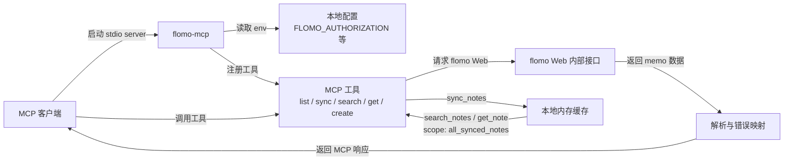

# flomo-mcp

`flomo-mcp` 是一个本地运行的 flomo MCP stdio server。它使用你自己的 flomo Web 登录态凭据，为支持 Model Context Protocol 的客户端提供 memo 读取、搜索、同步和新建能力。

> 本项目不是 flomo 官方项目。它依赖 flomo Web 的内部接口和会话凭据，接口可能变化；请只在你信任的本地环境中运行。

## 风险声明

使用本项目即表示你理解并接受以下风险：

- 本项目由社区开发者维护，不代表 flomo 官方，也不获得 flomo 官方背书或服务承诺。
- 本项目按“现状”提供，不保证持续可用、接口稳定、数据完整性或适配所有 MCP 客户端。
- 你需要自行确认使用方式符合 flomo 服务条款、所在地区法律法规和所在组织的安全要求。
- 你自行承担因使用本项目产生的账号异常、凭据泄露、数据丢失、请求失败、服务中断或第三方限制等风险。
- 在适用法律允许的最大范围内，项目开发者和贡献者不对上述风险造成的直接或间接损失承担责任。

## 功能

- 作为本地 stdio MCP server 运行，可接入支持 MCP 的客户端。
- 使用你的 flomo Web 会话凭据访问 memo，不需要 flomo Pro。
- 支持查看最近 memo、按 `slug` 获取单条 memo、创建新 memo。
- 支持分页同步 memo 到本地内存缓存，并在显式指定范围时执行全库搜索或定位。

## 运行流程



## 要求

- Node.js 20 或更高版本。
- npm。
- 支持 stdio MCP server 的客户端。
- 你自己的 flomo Web 会话 `Authorization`，必要时还包括 `Cookie`。

## 安装

### 通过 npm 安装

```bash
npm install -g flomo-mcp
```

安装后 MCP server 命令为：

```bash
flomo-mcp
```

### 通过源码运行

```bash
git clone <your-repo-url> flomo-mcp
cd flomo-mcp
npm install
npm run build
```

源码方式的运行入口是：

```bash
node dist/index.js
```

## 配置凭据

推荐在 MCP 客户端配置中通过 `env` 传入凭据。也可以复制 `.env.example` 为 `.env`，再填写本地凭据：

```bash
cp .env.example .env
```

Windows PowerShell:

```powershell
Copy-Item .env.example .env
```

至少需要：

```dotenv
FLOMO_AUTHORIZATION=Bearer your-token-here
```

## MCP 客户端配置

### npm 全局安装

```json
{
  "mcpServers": {
    "flomo": {
      "command": "flomo-mcp",
      "args": [],
      "env": {
        "FLOMO_AUTHORIZATION": "Bearer your-token-here",
        "FLOMO_BASE_URL": "https://flomoapp.com",
        "FLOMO_WEB_BASE_URL": "https://v.flomoapp.com",
        "FLOMO_TIMEZONE": "Asia/Shanghai",
        "FLOMO_REQUEST_TIMEOUT_MS": "30000"
      }
    }
  }
}
```

### 源码构建运行

把 `args` 改成你本地项目的 `dist/index.js` 绝对路径：

```json
{
  "mcpServers": {
    "flomo": {
      "command": "node",
      "args": ["D:/Projects/flomo-mcp/dist/index.js"],
      "env": {
        "FLOMO_AUTHORIZATION": "Bearer your-token-here",
        "FLOMO_BASE_URL": "https://flomoapp.com",
        "FLOMO_WEB_BASE_URL": "https://v.flomoapp.com",
        "FLOMO_TIMEZONE": "Asia/Shanghai",
        "FLOMO_REQUEST_TIMEOUT_MS": "30000"
      }
    }
  }
}
```

## 环境变量

| 变量 | 必填 | 默认值 | 说明 |
| --- | --- | --- | --- |
| `FLOMO_AUTHORIZATION` | 读取/写入时必填 | 无 | flomo Web 请求中的 `Authorization` header。 |
| `FLOMO_COOKIE` | 可选 | 无 | flomo Web Cookie；只有当前接口要求时再填写。 |
| `FLOMO_USER_AGENT` | 可选 | `Mozilla/5.0` | 请求 flomo Web 时使用的 User-Agent。 |
| `FLOMO_BASE_URL` | 可选 | `https://flomoapp.com` | flomo API 基础地址。 |
| `FLOMO_WEB_BASE_URL` | 可选 | `https://v.flomoapp.com` | flomo Web 基础地址。 |
| `FLOMO_TIMEZONE` | 可选 | `Asia/Shanghai` | IANA timezone。 |
| `FLOMO_REQUEST_TIMEOUT_MS` | 可选 | `30000` | flomo Web 请求超时时间，单位毫秒。 |
| `LOG_LEVEL` | 可选 | `info` | `debug`、`info`、`warn` 或 `error`。 |
| `FLOMO_READ_ENDPOINT` | 可选 | 内置当前路径 | 仅在 flomo Web 内部读取路径变化时覆盖。 |
| `FLOMO_SYNC_ENDPOINT` | 可选 | 内置当前路径 | 仅在 flomo Web 内部同步路径变化时覆盖。 |
| `FLOMO_WRITE_ENDPOINT` | 可选 | 内置当前路径 | 仅在 flomo Web 内部写入路径变化时覆盖。 |

完整示例见 [.env.example](.env.example)。

## MCP 工具

| 工具 | 说明 |
| --- | --- |
| `ping` | 检查 server 是否可用。 |
| `list_notes` | 列出最近 memo。 |
| `sync_notes` | 分页同步 memo 到本地内存缓存，只返回同步统计。 |
| `search_notes` | 默认搜索最近 memo；传入 `scope: "all_synced_notes"` 时搜索已同步缓存。 |
| `get_note` | 默认按 `slug` 从最近 memo 定位；传入 `scope: "all_synced_notes"` 时从已同步缓存定位。 |
| `create_note` | 新建 memo。 |

## 全量同步边界

本项目不提供“一次性返回全部笔记正文”的工具。需要全库检索时，先调用 `sync_notes` 建立本地内存缓存，再用 `search_notes` 或 `get_note` 显式指定：

```json
{
  "scope": "all_synced_notes"
}
```

`sync_notes` 支持 `pageSize`（最大 200）和 `maxPages`（最大 100）。如果达到页数上限但仍可能有更多笔记，返回值中的 `complete` 会是 `false`。

## 获取 Authorization

1. 浏览器登录 flomo Web。
2. 打开 DevTools 的 Network。
3. 刷新页面。
4. 找到 flomo 的 XHR/fetch 请求。
5. 从 Request Headers 复制 `Authorization: Bearer ...`。
6. 写入 MCP 客户端配置或本地 `.env` 的 `FLOMO_AUTHORIZATION`。

## 安全提醒

- 不要把 `FLOMO_AUTHORIZATION`、`FLOMO_COOKIE`、原始 memo 内容或 flomo 响应日志提交到 Git。
- 不要把凭据发给第三方 MCP host、在线调试工具或公开 issue。
- 项目会对日志 metadata 中常见的 `authorization`、`cookie`、`token` 字段做脱敏，但这不能替代你对凭据和日志的主动保护。
- 如果 flomo Web 内部接口变化，可以临时覆盖 `FLOMO_READ_ENDPOINT`、`FLOMO_SYNC_ENDPOINT` 或 `FLOMO_WRITE_ENDPOINT`。

## 许可证

MIT，见 [LICENSE](LICENSE)。
