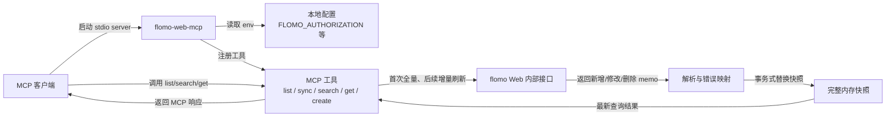

# flomo-web-mcp

`flomo-web-mcp` 是一个本地运行的 flomo MCP stdio server。它使用你自己的 flomo Web 登录态凭据，为支持 Model Context Protocol 的客户端提供 memo 读取、搜索、同步和新建能力。

> 本项目不是 flomo 官方项目。它依赖 flomo Web 的内部接口和会话凭据，接口可能变化；请只在你信任的本地环境中运行。

## 风险声明

使用本项目即表示你理解并接受以下风险：

- 本项目由社区开发者维护，不代表 flomo 官方，也不获得 flomo 官方背书或服务承诺。
- 本项目按“现状”提供，不保证持续可用、接口稳定、数据完整性或适配所有 MCP 客户端。
- 你需要自行确认使用方式符合 flomo 服务条款、所在地区法律法规和所在组织的安全要求。
- 你自行承担因使用本项目产生的账号异常、凭据泄露、数据丢失、请求失败、服务中断或第三方限制等风险。
- 在适用法律允许的最大范围内，项目开发者和贡献者不对上述风险造成的直接或间接损失承担责任。

## 功能

- 作为本地 stdio MCP server 运行，可接入支持 MCP 的客户端。
- 使用你的 flomo Web 会话凭据访问 memo，不需要 flomo Pro。
- 支持查看最新的完整内存快照、按 `slug` 获取正文与全部有序图片、创建新 memo。
- 首次访问自动分页建立完整内存快照；后续每次访问先以重叠游标做轻量增量刷新，合并新增和修改并移除远端删除项。
- 支持一次精确标签查询（自动统一 `#` 和大小写）与全文关键词查询；无需手动预调用 `sync_notes`，也无需重复搜索大小写/`#` 变体。
- 列表、搜索和同步只保留图片元数据；只有 `get_note` 按需下载图片并返回标准 MCP `ImageContent`。
- 新鲜同步失败或无法确认完整性时拒绝返回旧缓存作为最新完整结果。
- 图片下载具备 HTTPS/域名/DNS/重定向校验、类型校验和大小/数量限制；任一图片失败会将结果标记为 `partial`。

## 运行流程



## 要求

- Node.js 20 或更高版本。
- npm。
- 支持 stdio MCP server 的客户端。
- 你自己的 flomo Web 会话 `Authorization`，必要时还包括 `Cookie`。

## 安装

### 通过 npm 安装

```bash
npm install -g flomo-web-mcp
```

安装后 MCP server 命令为：

```bash
flomo-web-mcp
```

### 通过源码运行

```bash
git clone https://github.com/godisabug/flomo-web-mcp.git
cd flomo-web-mcp
npm install
npm run build
```

源码方式的运行入口是：

```bash
node dist/index.js
```

运行完整本地验证：

```bash
npm run verify
```

## 配置凭据

推荐在 MCP 客户端配置中通过 `env` 传入凭据。也可以复制 `.env.example` 为 `.env`，再填写本地凭据：

```bash
cp .env.example .env
```

Windows PowerShell:

```powershell
Copy-Item .env.example .env
```

至少需要：

```dotenv
FLOMO_AUTHORIZATION=Bearer your-token-here
```

## MCP 客户端配置

### npm 全局安装

```json
{
  "mcpServers": {
    "flomo": {
      "command": "flomo-web-mcp",
      "args": [],
      "env": {
        "FLOMO_AUTHORIZATION": "Bearer your-token-here",
        "FLOMO_BASE_URL": "https://flomoapp.com",
        "FLOMO_WEB_BASE_URL": "https://v.flomoapp.com",
        "FLOMO_TIMEZONE": "Asia/Shanghai",
        "FLOMO_REQUEST_TIMEOUT_MS": "30000",
        "FLOMO_IMAGE_REQUEST_TIMEOUT_MS": "15000",
        "FLOMO_IMAGE_MAX_BYTES": "10485760",
        "FLOMO_MEMO_IMAGE_MAX_BYTES": "31457280",
        "FLOMO_MEMO_IMAGE_MAX_COUNT": "20"
      }
    }
  }
}
```

### 源码构建运行

把 `args` 改成你本地项目的 `dist/index.js` 绝对路径：

```json
{
  "mcpServers": {
    "flomo": {
      "command": "node",
      "args": ["D:/Projects/flomo-web-mcp/dist/index.js"],
      "env": {
        "FLOMO_AUTHORIZATION": "Bearer your-token-here",
        "FLOMO_BASE_URL": "https://flomoapp.com",
        "FLOMO_WEB_BASE_URL": "https://v.flomoapp.com",
        "FLOMO_TIMEZONE": "Asia/Shanghai",
        "FLOMO_REQUEST_TIMEOUT_MS": "30000",
        "FLOMO_IMAGE_REQUEST_TIMEOUT_MS": "15000",
        "FLOMO_IMAGE_MAX_BYTES": "10485760",
        "FLOMO_MEMO_IMAGE_MAX_BYTES": "31457280",
        "FLOMO_MEMO_IMAGE_MAX_COUNT": "20"
      }
    }
  }
}
```

## 环境变量

| 变量 | 必填 | 默认值 | 说明 |
| --- | --- | --- | --- |
| `FLOMO_AUTHORIZATION` | 读取/写入时必填 | 无 | flomo Web 请求中的 `Authorization` header。 |
| `FLOMO_COOKIE` | 可选 | 无 | flomo Web Cookie；只有当前接口要求时再填写。 |
| `FLOMO_USER_AGENT` | 可选 | `Mozilla/5.0` | 请求 flomo Web 时使用的 User-Agent。 |
| `FLOMO_BASE_URL` | 可选 | `https://flomoapp.com` | flomo API 基础地址。 |
| `FLOMO_WEB_BASE_URL` | 可选 | `https://v.flomoapp.com` | flomo Web 基础地址。 |
| `FLOMO_TIMEZONE` | 可选 | `Asia/Shanghai` | IANA timezone。 |
| `FLOMO_REQUEST_TIMEOUT_MS` | 可选 | `30000` | flomo Web 请求超时时间，单位毫秒。 |
| `FLOMO_IMAGE_REQUEST_TIMEOUT_MS` | 可选 | `15000` | 单次图片请求超时，单位毫秒。 |
| `FLOMO_IMAGE_MAX_BYTES` | 可选 | `10485760` | 单张图片最大字节数。 |
| `FLOMO_MEMO_IMAGE_MAX_BYTES` | 可选 | `31457280` | 单条 memo 全部图片最大总字节数。 |
| `FLOMO_MEMO_IMAGE_MAX_COUNT` | 可选 | `20` | 单条 memo 最多下载的图片数。 |
| `LOG_LEVEL` | 可选 | `info` | `debug`、`info`、`warn` 或 `error`。 |
| `FLOMO_READ_ENDPOINT` | 可选 | 内置当前路径 | 仅在 flomo Web 内部读取路径变化时覆盖。 |
| `FLOMO_SYNC_ENDPOINT` | 可选 | 内置当前路径 | 仅在 flomo Web 内部同步路径变化时覆盖。 |
| `FLOMO_WRITE_ENDPOINT` | 可选 | 内置当前路径 | 仅在 flomo Web 内部写入路径变化时覆盖。 |

完整示例见 [.env.example](.env.example)。

## MCP 工具

| 工具 | 说明 |
| --- | --- |
| `ping` | 检查 server 是否可用。 |
| `list_notes` | 访问前自动刷新完整内存快照，再列出最新 memo。 |
| `sync_notes` | 管理员显式强制重建内存快照；普通查询无需调用。 |
| `search_notes` | 访问前自动刷新；`query` 做全文搜索，`tag` 做精确标签搜索，可单独或组合使用。 |
| `get_note` | 访问前自动刷新，按 `slug` 从完整内存快照定位并按原始顺序返回全部图片 `ImageContent`。 |
| `create_note` | 新建 memo。 |

## 内存快照与新鲜度边界

- `list_notes`、`search_notes`、`get_note` 每次调用都先执行新鲜度同步；首次访问完整分页拉取，后续访问从最新页开始分页，直到越过上次 `updated_at + slug` 水位之前的重叠窗口。
- 增量结果按 `slug` 合并：新增 memo 插入、已存在 memo 覆盖更新、远端删除项从当前快照移除。
- 只有完整同步确认到达末尾后才原子提交快照；同步失败、分页未闭合，或完整分页缺少有效游标时，拒绝用旧缓存生成“最新/完整”结论。显式 `sync_notes` 的不完整结果也不会覆盖已有完整快照。
- `search_notes` 的 `tag` 参数做大小写不敏感的精确标签匹配，`agent`、`#agent`、`#Agent` 视为同一标签；不要重复查询这些变体。
- `sync_notes` 只用于显式强制重建或诊断。它支持 `pageSize`（最大 200）和 `maxPages`（最大 100）。
- 快照只存在 MCP 进程内存中，不写入数据库；MCP 或 Gateway 重启后的第一次访问会重新完整同步。

## 多模态读取边界

- Memo 模型包含有序 `images` 元数据和 `imageCount`；纯图片 memo 也是有效 memo。
- `list_notes`、`search_notes`、`sync_notes` 不下载图片二进制，也不做 OCR 或视觉索引。
- `get_note` 的第一个内容块是正文、memo 元数据及 `complete` / `partial` 状态，后续内容块是按顺序排列的 MCP 图片内容。
- 遇到图片 401/403 时，server 会刷新该 memo 的附件引用并重试一次；仍失败则返回对应图片序号及脱敏原因。
- 图片只在当前调用中读入内存并交给 MCP 客户端，不建立永久图片镜像；短期复用由 Hermes 等客户端的运行时图片缓存负责。
- 当前解析覆盖 HTML `` 以及常见 `images`、`files`、`attachments`、`resources`、`media` 数组形态。真实 flomo 字段可能随内部接口变化，需用授权账号单独验证。

## 相关项目

- [flomo-web-cli](https://github.com/godisabug/flomo-web-cli)：同一 flomo Web 访问逻辑的命令行工具，适合在终端或脚本里直接操作 flomo memo。
- `flomo-web-mcp`：当前项目，适合接入支持 Model Context Protocol 的客户端。

## 获取 Authorization

1. 浏览器登录 flomo Web。
2. 打开 DevTools 的 Network。
3. 刷新页面。
4. 找到 flomo 的 XHR/fetch 请求。
5. 从 Request Headers 复制 `Authorization: Bearer ...`。
6. 写入 MCP 客户端配置或本地 `.env` 的 `FLOMO_AUTHORIZATION`。

## 安全提醒

- 不要把 `FLOMO_AUTHORIZATION`、`FLOMO_COOKIE`、原始 memo 内容或 flomo 响应日志提交到 Git。
- 不要把凭据发给第三方 MCP host、在线调试工具或公开 issue。
- 项目会对日志 metadata 中常见的 `authorization`、`cookie`、`token` 字段做脱敏，但这不能替代你对凭据和日志的主动保护。
- 如果 flomo Web 内部接口变化，可以临时覆盖 `FLOMO_READ_ENDPOINT`、`FLOMO_SYNC_ENDPOINT` 或 `FLOMO_WRITE_ENDPOINT`。

## 许可证

MIT，见 [LICENSE](LICENSE)。
