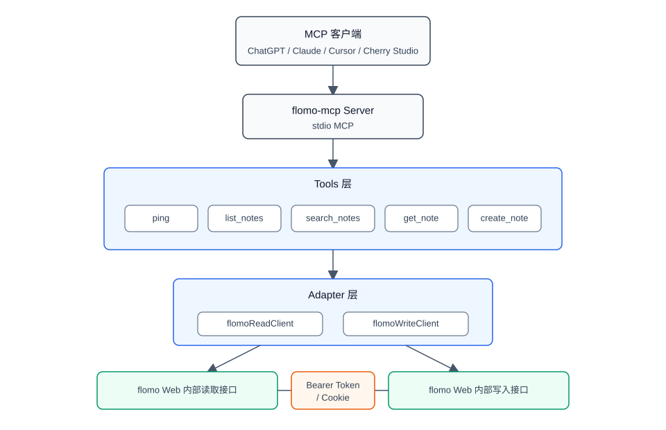
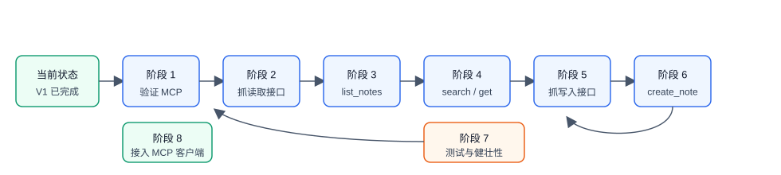
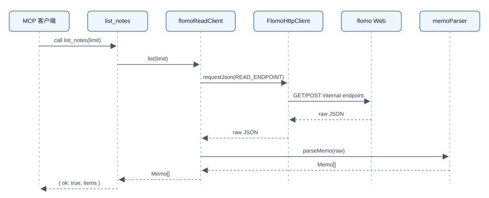
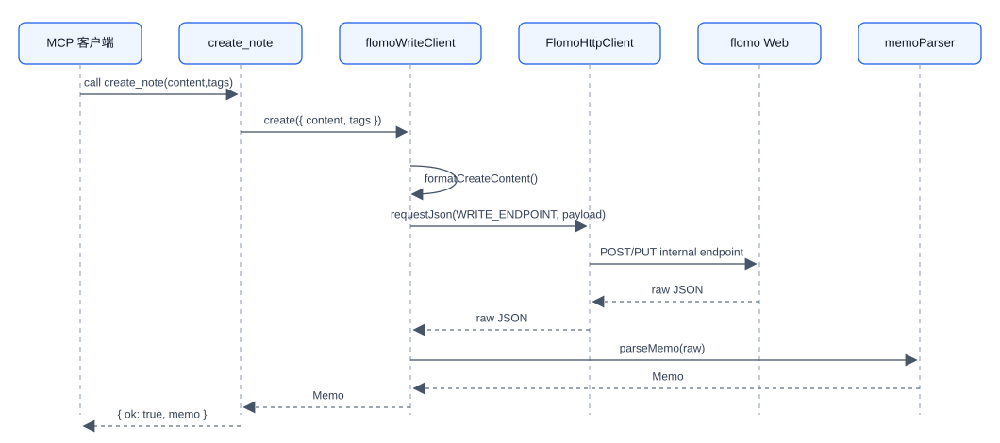
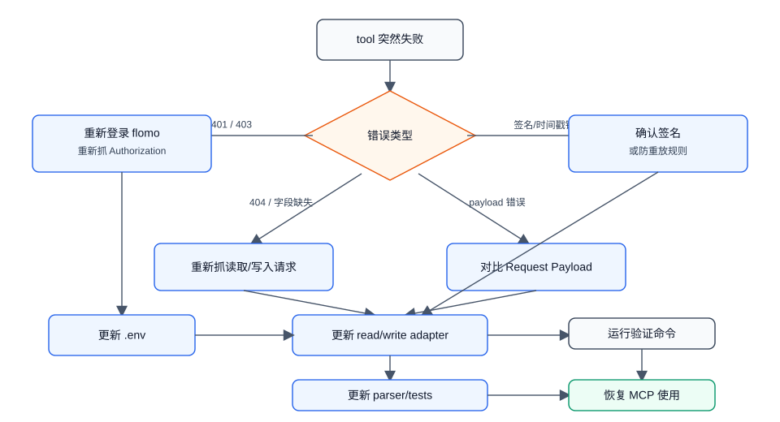

# 开发流程

本文档把 flomo-mcp 的后续开发拆成可执行阶段。当前项目已经完成 MCP 外壳、工具注册、配置读取、parser、错误类型和基础测试；后续工作的重点是把 flomo Web 当前真实读写请求固化到 adapter 层。

## 工作模型

本项目不是官方 flomo API 客户端，而是基于网页登录态封装 flomo Web 内部接口：



Mermaid 源码：[`work-model.mmd`](assets/development-flow/work-model.mmd)

分层边界：

- MCP Server：只负责 stdio 协议、注册 tools、把返回值整理成 MCP response。
- Tools 层：只做入参校验和错误映射，不暴露 flomo 内部接口细节。
- Adapter 层：封装 flomo Web 真实请求，是后续主要开发位置。
- Parser 层：把内部接口返回转成稳定的 `Memo` 模型。
- Config 层：从 `.env` 读取 Authorization、endpoint、User-Agent、时区等配置。

## 主流程



Mermaid 源码：[`main-flow.mmd`](assets/development-flow/main-flow.mmd)

开发顺序必须优先读取，再做写入。读取接口风险低，能先验证 Authorization、请求头、parser 和 tool 调用链；写入接口更可能依赖 Cookie、签名或防重放字段，应放在读取跑通之后。

## 阶段 1：验证 MCP 壳子

目标：确认当前工程能被 MCP 宿主加载，且 `ping` tool 可调用。

输入：

- 已构建的 `dist/index.js`
- MCP 客户端配置

执行：

```bash
npm run build
```

把以下命令配置给 MCP 客户端：

```json
{
  "mcpServers": {
    "flomo": {
      "command": "node",
      "args": ["/root/projects/flomo-mcp/dist/index.js"]
    }
  }
}
```

验收：

- MCP 客户端能看到 `ping` tool。
- 调用 `ping` 返回 `{ "ok": true }`。
- 此阶段不需要访问 flomo，也不需要 `.env`。

主要文件：

- `src/index.ts`
- `src/server.ts`
- `src/tools/common.ts`

## 阶段 2：抓取读取接口

目标：在浏览器 DevTools 中找到 flomo Web 获取最近 memo 的真实请求。

执行步骤：

1. 浏览器登录 flomo Web。
2. 打开 DevTools 的 Network。
3. 勾选 Fetch/XHR。
4. 刷新页面。
5. 找到返回最近 memo 列表的请求。
6. 复制请求信息，先用 curl 或 Postman 复现。

必须记录：

- 请求 URL 和方法。
- `Authorization` 是否存在。
- 是否还需要 `Cookie`。
- Query 参数。
- 关键请求头，例如 `Origin`、`Referer`、`User-Agent`。
- 返回 JSON 中 memo 数组字段名。
- memo 唯一标识字段名。
- 分页字段。

产出：

```bash
FLOMO_AUTHORIZATION=Bearer xxxxxxxxx
FLOMO_READ_ENDPOINT=/真实读取路径
```

验收：

- 离开浏览器页面后，curl/Postman 仍能读取最近 memo。
- 响应体中能明确定位 memo 数组。
- 不把 Authorization 或 Cookie 写进源码、README 或测试快照。

## 阶段 3：实现 `list_notes`

目标：把读取接口固化到 `flomoReadClient`，让 MCP tool 返回统一的 `Memo[]`。

请求链路：



Mermaid 源码：[`list-notes-sequence.mmd`](assets/development-flow/list-notes-sequence.mmd)

主要改动：

- `src/clients/flomoReadClient.ts`
- `src/clients/http.ts`
- `src/parsers/memoParser.ts`
- `tests/readClient.test.ts`
- `tests/parsers.test.ts`

实现要求：

- `list(limit)` 默认返回最近 20 条。
- 最大 `limit` 保持 100。
- 使用统一 `Memo` 模型，不直接暴露 flomo 原始 JSON。
- 返回结构变化时抛出明确 parser/request 错误。
- 保留 30 到 60 秒轻缓存，减少重复请求。

验收：

```bash
npm run typecheck
npm test
npm run build
```

并通过 MCP 客户端调用 `list_notes`，能看到最近 memo。

## 阶段 4：实现 `search_notes` 和 `get_note`

目标：基于 `list_notes` 的读取结果，先做本地过滤和单条定位。

`search_notes` 规则：

- 查询 `content` 和 `tags`。
- 大小写不敏感。
- 默认返回 20 条，最大 100 条。
- 首版不逆向服务端全文检索接口。

`get_note` 规则：

- 通过 `slug` 匹配。
- 找不到时返回 `memo: null`，不视为异常。
- 后续如果发现单条详情接口，再替换底层实现。

主要文件：

- `src/clients/flomoReadClient.ts`
- `src/tools/searchNotes.ts`
- `src/tools/getNote.ts`
- `tests/readClient.test.ts`

验收：

- 搜索存在关键词能返回结果。
- 搜索不存在关键词返回空数组。
- 通过已有 memo 的 `slug` 能获取单条。
- 不新增 flomo 请求也能完成这两个 tool。

## 阶段 5：抓取写入接口

目标：找到 flomo Web 新建 memo 的真实请求。

执行步骤：

1. 打开 flomo Web 和 DevTools Network。
2. 新建一条测试 memo，例如：

   ```text
   MCP 写入测试
   #flomo #mcp
   ```

3. 在 Fetch/XHR 中筛选 `memo`、`create`、`save`、`draft` 等关键词。
4. 复制请求并用 curl/Postman 复现。

必须记录：

- 请求 URL。
- 请求方法。
- Request Payload。
- Content-Type。
- 是否需要 Cookie。
- 是否需要时间戳、签名、防重放字段。
- 标签是写在正文中，还是单独字段。
- 成功响应中是否返回 slug。

产出：

```bash
FLOMO_WRITE_ENDPOINT=/真实写入路径
# 如果写入必须依赖 Cookie，再增加：
FLOMO_COOKIE=...
```

验收：

- curl/Postman 能创建 memo。
- 创建后的 memo 在 flomo 网页端可见。
- 响应体能定位创建后的 memo，或者至少能定位 slug/id。

## 阶段 6：实现 `create_note`

目标：让 MCP tool 能创建 flomo memo。

请求链路：



Mermaid 源码：[`create-note-sequence.mmd`](assets/development-flow/create-note-sequence.mmd)

主要改动：

- `src/clients/flomoWriteClient.ts`
- `src/clients/http.ts`
- `src/parsers/tagParser.ts`
- `tests/writeClient.test.ts`

实现要求：

- `content` 不能为空。
- `tags` 统一标准化为 `#tag` 形式。
- 如果 flomo 当前接口要求标签写在正文中，使用 `formatCreateContent`。
- 如果接口要求单独字段，调整 payload 生成逻辑，但保持 MCP tool 入参不变。
- 写入成功后清理读取缓存，避免 `list_notes` 返回旧数据。

验收：

- `create_note` 能创建 memo。
- 新 memo 可在网页端看到。
- 返回的 `memo.slug`、`content`、`tags`、`url` 可用。
- Token/Cookie 不出现在日志中。

## 阶段 7：健壮性与测试

目标：把“能跑”推进到“日常可用”。

错误场景：

- Token 失效：返回 `AUTH_EXPIRED`。
- 请求体不匹配：返回 `BAD_REQUEST`。
- 签名错误：返回 `SIGN_INVALID`。
- 接口字段变化：返回 `PARSER_FAILED` 或 `REMOTE_CHANGED`。
- 请求过于频繁：返回 `RATE_LIMITED`。

测试范围：

- `parseMemo` 对不同原始字段名的兼容。
- 标签标准化和去重。
- 本地搜索过滤。
- 写入 payload 格式化。
- HTTP 错误映射。

常规验证命令：

```bash
npm run typecheck
npm test
npm run build
```

必要时增加人工回归：

- `ping` 可用。
- `list_notes` 可用。
- `search_notes` 可用。
- `get_note` 可用。
- `create_note` 可用。
- 创建后的 memo 在 flomo Web 可见。

## 阶段 8：接入 MCP 客户端

目标：把本地 server 作为长期使用的 MCP 工具接入宿主。

推荐先构建：

```bash
npm run build
```

配置示例：

```json
{
  "mcpServers": {
    "flomo": {
      "command": "node",
      "args": ["/root/projects/flomo-mcp/dist/index.js"],
      "env": {
        "FLOMO_AUTHORIZATION": "Bearer xxxxxxxxxxxxxxxxx",
        "FLOMO_BASE_URL": "https://flomoapp.com",
        "FLOMO_TIMEZONE": "Asia/Shanghai",
        "FLOMO_READ_ENDPOINT": "/真实读取路径",
        "FLOMO_WRITE_ENDPOINT": "/真实写入路径"
      }
    }
  }
}
```

如果写入接口确认依赖 Cookie，再加：

```json
{
  "FLOMO_COOKIE": "..."
}
```

## 接口变化时的维护流程

flomo Web 内部接口不是稳定公开 API。出现失败时按以下流程处理：



Mermaid 源码：[`maintenance-flow.mmd`](assets/development-flow/maintenance-flow.mmd)

维护原则：

- 优先只改 adapter 和 parser。
- 不把 flomo 内部字段泄漏到 tools 返回。
- 不扩大首版功能范围。
- 不提交 `.env`、Authorization、Cookie 或完整私人 memo 内容。

## 完成定义

首版 V1 完成需要同时满足：

- MCP 客户端能加载 server。
- `ping` 正常。
- `list_notes` 能返回最近 memo。
- `search_notes` 能按关键词和标签过滤。
- `get_note` 能按 slug 返回单条 memo。
- `create_note` 能创建新 memo。
- `.env.example` 和 README 与实际配置一致。
- `npm run typecheck`、`npm test`、`npm run build` 全部通过。
- 日志不会输出 Authorization、Cookie 或完整私人 memo 内容。
